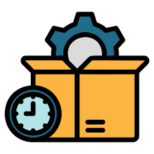

# TITULO PROYECTO PRACTICA 2

## DESCRIPCIÓN

El Sistema de Gestión de Inventarios es una solución diseñada para optimizar el control y la administración de los productos en almacenes o tiendas. Este software permite realizar un seguimiento detallado de las existencias, registrar ventas, compras, y generar informes personalizados en tiempo real.

## FUNCIONALIDADES PRINCIPALES

#### 1. **Gestión de Productos**
- Agregar, editar o eliminar productos del inventario.
- Asignar categorías y códigos únicos a cada producto.
- Control de niveles de stock con alertas automáticas cuando el inventario es bajo.

#### 2. **Módulo de Ventas**
- Registro automático de ventas con reducción instantánea de inventario.
- Generación de facturas personalizadas y envíos de comprobantes por correo electrónico.
- Informe de ventas diarias, semanales y mensuales.

#### 3. **Control de Compras**
- Posibilidad de registrar compras a proveedores.
- Actualización automática de stock al recibir productos.
- Historial completo de órdenes de compra y pagos a proveedores.

## REQUISITOS DEL SISTEMA
- *Lenguajes de Programación:* Python, JavaScript (con React para la interfaz).
- *Base de Datos:* MySQL o PostgreSQL.
- *Servidor:* Nginx o Apache.
- *Compatibilidad:* Funciona en sistemas operativos Windows, Linux y macOS.

## RIESGOS DEL PROYECTO

| **ID Riesgo** | **Descripción**                  | **Probabilidad** | **Impacto** | **Plan de Mitigación**                        |
|---------------|----------------------------------|------------------|-------------|-----------------------------------------------|
| RISK001       | Retraso en el desarrollo         | Media            | Alto        | Revisión semanal del cronograma               |
| RISK002       | Problemas de integración         | Baja             | Alto        | Pruebas continuas de integración              |
| RISK003       | Cambios en los requisitos        | Media            | Medio       | Documentar y revisar requisitos semanalmente   |
 

## TAREAS PENDIENTES
- [x]  Completar el análisis de requisitos
- [ ] Diseñar la interfaz de usuario
- [ ] Implementar la funcionalidad de login
- [ ] Realizar pruebas de integración
- [ ] Documentar el sistema

### PROGRAMA DE GESTION DE TAREAS PENDIENTES 
`import java.util.ArrayList;`
`import java.util.List;`

`public class Tarea {`
`    private String id;`
`    private String descripcion;`
`    private String responsable;`
`    private String fechaLimite;`
`    private String estado;`

`    public Tarea(String id, String descripcion, String responsable, String fechaLimite, String estado) {`
`        this.id = id;`
`        this.descripcion = descripcion;`
`        this.responsable = responsable;`
`        this.fechaLimite = fechaLimite;`
`        this.estado = estado;`
`    }`

`    public String getId() {`
`        return id;`
`    }`

`    public String getDescripcion() {`
`        return descripcion;`
`    }`

`    public String getResponsable() {`
`        return responsable;`
`    }`

`    public String getFechaLimite() {`
`        return fechaLimite;`
`    }`

`    public String getEstado() {`
`        return estado;`
`    }`

`    @Override`
`    public String toString() {`
`        return String.format("| %s | %s | %s | %s | %s |", id, descripcion, responsable, fechaLimite, estado);`
`    }`
`}`

`public class ListaDeTareas {`
`    public static void main(String[] args) {`
`        List<Tarea> tareas = new ArrayList<>();`

`        // Agregar tareas a la lista`
`        tareas.add(new Tarea("T001", "Completar el análisis de requisitos", "Juan Pérez", "2024-01-15", "Pendiente"));`
`        tareas.add(new Tarea("T002", "Diseñar la interfaz de usuario", "Ana Gómez", "2024-02-01", "En Progreso"));`
`        tareas.add(new Tarea("T003", "Implementar la funcionalidad de login", "Luis Martínez", "2024-02-20", "Pendiente"));`
`        tareas.add(new Tarea("T004", "Realizar pruebas de integración", "Marta López", "2024-06-01", "Pendiente"));`
`        tareas.add(new Tarea("T005", "Documentar el sistema", "Carlos Fernández", "2024-06-15", "Pendiente"));`

`        // Imprimir la lista de tareas`
`        System.out.println("| **ID Tarea** | **Descripción**                        | **Responsable** | **Fecha Límite** | **Estado**     |");`
`        System.out.println("|--------------|----------------------------------------|------------------|-------------------|----------------|");`
`        for (Tarea tarea : tareas) {`
`            System.out.println(tarea);`
`        }`
`    }`
`}`

## IMAGEN

## SOFTWARES SIMILARES
- [Odoo](https://www.odoo.com/es_ES/app/inventory?utm_source=google&utm_medium=cpc&utm_campaign=WEU-ES-ES-Inventory_App-Specific-Values&gad_source=1&gclid=Cj0KCQjwgL-3BhDnARIsAL6KZ696XfUeXsF92iy5hx_IPGq3z3jgn0MBnFiqz4tVLPVFYrvJPT4SOSQaAtTSEALw_wcB)
- [Timly](https://timly.com/es/software-de-gestion-de-inventarios-medicos/?utm_feeditemid&utm_device=c&utm_term=gesti%C3%B3n%20de%20inventario&utm_source=google&utm_medium=cpc&utm_campaign=ES%2B%20%7C%20Gestion%20de%20inventarios&hsa_cam=21159235138&hsa_grp=160201983029&hsa_mt=p&hsa_src=g&hsa_ad=699459815272&hsa_acc=7499781921&hsa_net=adwords&hsa_kw=gesti%C3%B3n%20de%20inventario&hsa_tgt=kwd-316705517492&hsa_ver=3&gad_source=1&gclid=Cj0KCQjwgL-3BhDnARIsAL6KZ69XujBC53dDsIKbCgl0J3xKn2nF4pMSeY0g9_cBOTcsL7ZSyGxWw6saAkRvEALw_wcB)
- [Yunbit](https://www.yunbitsoftware.com/sga-sistema-de-gestion-de-almacenes/?gad_source=1&gclid=Cj0KCQjwgL-3BhDnARIsAL6KZ6_gMSB7GVP3kz5LiAXuaC1_ucJkBH29jFnUo_DsDJindKJPgJtJBt4aAo89EALw_wcB)